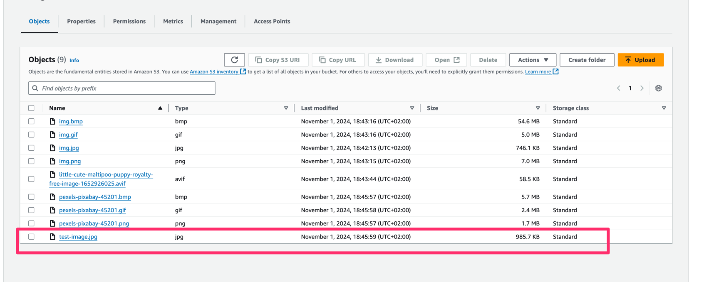
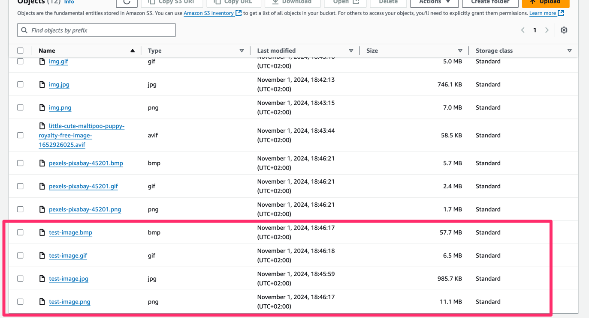

# Image Converter
### Set up
- Create function (lambda_function.py)
- Add layer to use image library (used layer from https://github.com/keithrozario/Klayers)
- Add permissions and role to aws function to use s3

### Result

### Before trigger

### Wait for 30 seconds, Result
